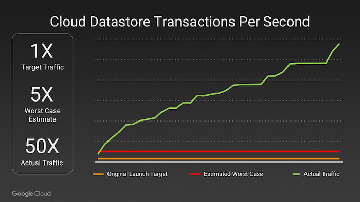

Google has been managing containers at scale for more than fifteen years and built different container management systems. Each new system was heavily influenced by predecessors. 

The first container management system build by Google was internally called Borg. It was built to manage both long-running services and batch jobs. Borg shares machines between these two types of applications as a way of increasing resource utilization and thereby reducing costs. Such sharing was possible because container support in the Linux kernel was becoming available (indeed, Google contributed much of the container code to the Linux kernel), which enabled better isolation between user-facing services and CPU-hungry batch processes.

Omega, an offspring of Borg, was driven by a desire to improve the software engineering of the Borg ecosystem. It applied many of the patterns that had proved successful in Borg, but was built from the ground up to have a more consistent, principled architecture. Omega stored the state of the cluster in a centralized transaction-oriented store. 

Kubernetes (Greek for "Helmsman") was firsts announced by Google in 2014. It's development and design are heavily influenced by Google's Borg  and Omega systems. Kubernetes is open source, in contrast to Borg and Omega.

Kubernetes v 1.0 was released on July 21, 2015. Along with the release, Google partnered with the Linux Foundation to form the Cloud Native Computing Foundation (CNCF). The CNFC aims to build sustainable ecosystems and to foster a community around a constellation of high-quality projects that orchestrate containers. 

At the moment, CNCF is supported by over 500 members, including Google, Microsoft, Oracle, Amazon, Huawei, IBM, Red Hat, Cisco, Apple, Docker, Alibaba, and many others.

Pokemon GO was the largest Kubernetes deployment on Google Container Engine ever. Due to the scale of the cluster and accompanying throughput, a multitude of bugs were identified and fixed.

The graph above tells the story: the teams targeted **1X** player traffic, with a worst-case estimate of roughly **5X** this target. Pokémon GO’s popularity quickly surged player traffic to **50X** the initial target, ten times the worst-case estimate.