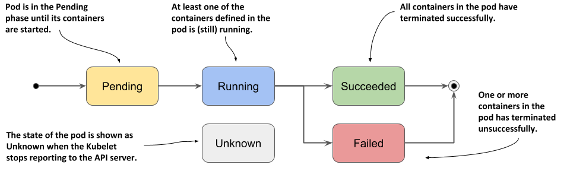

# Pods

The most important primitive is the Pod. It is the smallest unit that you can create and manage in Kubernetes, It lets you run a containerized application. In practice, you’ll often encounter a one to one mapping between a Pod and a container, however, there are use cases we’ll discuss in a later chapter that benefit from declaring more than one container in a single Pod. The shared context of a Pod is a set of Linux namespaces, cgroups, and potentially other facets of isolation.

When created, each pod is assigned a unique IP address. Every container in a Pod shares the network namespace, including the IP address and network ports. Inside a Pod, the containers that belong to the Pod can communicate with one another using `localhost`. Containers that want to interact with a container running in a different Pod can use IP networking to communicate. In general a pod has the following DNS resolution:

`pod-ip-address.namespace.pod.cluster.local`. 

You'll rarely create individual Pods directly in Kubernetes — even singleton Pods. This is because Pods are designed as relatively ephemeral, disposable entities. When a Pod gets created (directly by you, or indirectly by a controller), the new Pod is scheduled to run on a Node in your cluster. The Pod remains on that node until the Pod finishes execution, the Pod object is deleted, the Pod is *evicted* for lack of resources, or the node fails. In the event of node failure pods that are not bound to a ReplicaSet or Deployment will not be rescheduled.

### Pod phase



| Value       | Description                                                  |
| :---------- | :----------------------------------------------------------- |
| `Pending`   | The Pod has been accepted by the Kubernetes cluster, but one or more of the containers has not been set up and made ready to run. This includes time a Pod spends waiting to be scheduled as well as the time spent downloading container images over the network. |
| `Running`   | The Pod has been bound to a node, and all of the containers have been created. At least one container is still running, or is in the process of starting or restarting. |
| `Succeeded` | All containers in the Pod have terminated in success, and will not be restarted. |
| `Failed`    | All containers in the Pod have terminated, and at least one container has terminated in failure. That is, the container either exited with non-zero status or was terminated by the system. |
| `Unknown`   | For some reason the state of the Pod could not be obtained. This phase typically occurs due to an error in communicating with the node where the Pod should be running. |

### Container status

| Value        | Description                                                  |
| :----------- | :----------------------------------------------------------- |
| `Waiting`    | If a container is not in either the `Running` or `Terminated` state, it is `Waiting` |
| `Running`    | Container is executing without issues                        |
| `Terminated` | A container in this state began execution and then either ran to completion or failed for some reason. |

## Deployment definition

```yaml
apiVersion: v1
kind: Pod
metadata:
  labels:
    env: dev
    run: nginx
  name: nginx
spec:
  containers:
  - name: nginx
    image: nginx:1.17
```

## Examples

Run a pod from command line...

```bash
$ kubectl run nginx --image=nginx:1.17
```

... or, define a pod in a [deployment file](../deployments/01-pod.yaml) and apply it

```bash
$ kubectl apply -f deployments/01-pod.yaml
```

Let's see the result of our work

```bash
$ kubectl get pods
NAME    READY   STATUS    RESTARTS   AGE
nginx   1/1     Running   0          24s

$ kubectl run --image=raarts/netutils netutils --restart=never -- sleep 600

$ kubectl exec -it netutils -- curl $(kubectl get pod nginx -o jsonpath='{.status.podIP}')

<!DOCTYPE html>
<html>
<head>
<title>Welcome to nginx!</title>
..........

```

A detailed documentation regarding deployment object structure is available directly from kubectl

```bash
$ kubectl explain pods

$ kubectl explain pods.metadata
```

