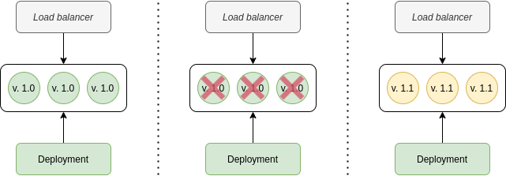

# ReplicaSets, DaemonSets and Deployments

Earlier we discussed that running Pods directly in Kubernetes is not something you should do. When this Pod is terminated for any reason (job terminated, pod failed, lack of resources, node failed), another Pod will not be automatically scheduled. A single pod is not scalable either. Manually running new pods when the load increases and terminating these pods during low traffic is not something you can do either. 

## ReplicaSet

A ReplicaSet's purpose is to maintain a stable set of replica Pods running at any given time. It is defined with fields, including a selector that specifies how to identify Pods it can acquire, a number of replicas indicating how many Pods it should be maintaining, and a pod template specifying the data of new Pods it should create to meet the number of replicas criteria. A ReplicaSet then fulfills its purpose by creating and deleting Pods as needed to reach the desired number. When a ReplicaSet needs to create new Pods, it uses its Pod template.

```yaml
apiVersion: apps/v1
kind: ReplicaSet
metadata:
  name: nginx
  labels:
    app: nginx
    tier: frontend
spec:
  replicas: 3                  # Number of replicas
  selector:                    # Pod selector. Match all pods with specified labels
    matchLabels:
      app: nginx
      tier: frontend
  template:                    # Pod template used to create new pods
    metadata:
      labels:
        app: nginx
        tier: frontend
    spec:
      containers:
      - name: nginx
        image: nginx:1.17
```


```bash
$ kubectl create -f deployments/03-rs.yaml

$ kubectl get pods
NAME          READY   STATUS    RESTARTS   AGE
nginx-47n2c   1/1     Running   0          85s
nginx-pslmv   1/1     Running   0          85s
nginx-zct49   1/1     Running   0          85s

$ kubectl delete pod nginx-pslmv

$ kubectl get pods
NAME          READY   STATUS    RESTARTS   AGE
nginx-47n2c   1/1     Running   0          2m13s
nginx-tk8w8   1/1     Running   0          33s
nginx-zct49   1/1     Running   0          2m13s

$ kubectl delete -f deployments/03-rs.yaml
NAME          READY   STATUS        RESTARTS   AGE
nginx-47n2c   0/1     Terminating   0          11m
nginx-tk8w8   0/1     Terminating   0          9m58s
nginx-zct49   0/1     Terminating   0          11m

```

A ReplicaSet ensures that a specified number of pod replicas are running at any given time. However, a Deployment is a higher-level concept that manages ReplicaSets and provides declarative updates to Pods along with a lot of other useful features. This actually means that you may never need to manipulate ReplicaSet objects: use a Deployment instead, and define your application in the spec section.

## Deployments

Deployments represent a set of multiple, identical Pods with no unique identities. A Deployment runs multiple replicas of your application and automatically replaces any instances that fail or become unresponsive. In this way, Deployments help ensure that one or more instances of your application are available to serve user requests.

When a Deployment's Pod template is changed, new Pods are automatically created.

Using Deployments you can simply and reliably roll out new software versions without downtime or errors. There are different ways we can roll out new versions, like Recreate, Rolling Updates, Blue/Green deployments and Canary builds.

| Strategy     | Description                                                  | Zero downtime             | Real traffic testing      | Cost                      | Negative Impact on users  | Native support            |
| ------------ | ------------------------------------------------------------ | ------------------------- | ------------------------- | ------------------------- | ------------------------- | ------------------------- |
| `Recreate`   | Kubernetes terminates all existing pods before the new one are created. With a recreate deployment strategy there is some downtime, however there won’t be 2 versions of the containers running at the same time |  |  |  |  |  |
| `Rolling`    | A rolling update strategy provides a controlled, phased replacement of the application's pods, ensuring that there are always a minimum number available. By default, Kubernetes makes sure that maximum of only 25% of Pods are unavailable at any time, and it also won’t over provision more than 25% of the number of pods specified in the desired state. |  |  |  |  |  |
| `Blue/Green` | The old version of the application (green) and the new version (blue) get deployed at the same time. When both of these are deployed, users only have access to the green; whereas, the blue is available to your QA team for test automation on a separate service or via direct port-forwarding. Once the acceptance criteria are passed, blue environment is promoted to green. |  |  |  |  |  |
| `Canary`     | The name of Canary Deployment Strategy has its origins rooted back to coal miners. A canary is used for when you want to test some new functionality. Traditionally you may have had two almost identical servers: one that goes to all users and another with the new features that gets rolled out to a subset of users and then compared. When no errors are reported, the new version can gradually roll out to the rest of the infrastructure. |  |  |  |  |  |

### Recreate



Rolling


Blue/Green


Canary


# DaemonSet

A DaemonSet ensures that all (or some) Nodes run a copy of a Pod. As nodes are added to the cluster, Pods are added to them. As nodes are removed from the cluster, those Pods are garbage collected. Deleting a DaemonSet will clean up the Pods it created.

Some typical uses of a DaemonSet are:

- running a node monitoring daemon on every node
- running a logs collection daemon on every node
- running a cluster storage daemon on every node