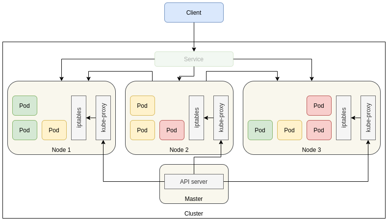

# Services

As discussed earlier, Pods are ephemeral, disposable resources. Pods are created and destroyed to match the state of your cluster. A ReplicaSet or a Deployment automatically maintain a stable set of replica Pods running at any given time by creating or destroying pods dynamically. Each Pod gets its own IP address, however in a Deployment, the set of Pods running in one moment in time could be different from the set of Pods running that application a moment later. While the actual Pods that compose the application may change, the clients should not need to be aware of that, nor should they need to keep track of the pods themselves.

The idea of a Service is to group a set of Pod endpoints into a single resource. A Service is responsible for exposing an interface to the pods, which enables network access from either within the cluster or between external processes and the service. Services connect a set of pods to an abstracted service name and IP address, at the same time providing service discovery and routing between pods. By default, you get a stable ClusterIP address and a host name (DNS entry) that clients inside the cluster can use to contact Pods in the Service. A client sends a request to the ClusterIP address or hostname, and the request is routed to one of the Pods in the Service. Kubernetes only releases the ClusterIP and hostname if the Service is deleted from the cluster's configuration. At first glance, a Service may seem to be a single point of failure for your applications. However, Kubernetes spreads traffic as evenly as possible across the full set of Pods, running on many nodes, so a cluster can withstand an outage affecting one or more (but not all) nodes.

Kubernetes manages connectivity among Pods and Services using the `kube-proxy` component. This is deployed as a static Pod on each node by default (DaemonSet).

`kube-proxy` watches the Kubernetes API server and continually maps the ClusterIP to healthy Pods by adding and removing destination NAT (DNAT) rules to the node's `iptables` subsystem. When a container running in a Pod sends traffic to a Service's ClusterIP, the node selects a Pod at random and routes the traffic to that Pod. Since services are not node-specific, a service can point to a pod regardless of where it runs in the cluster at any given moment in time.  

By default, Pods can communicate freely inside the cluster, but connections outside the cluster cannot access Services via its ClusterIP or hostname. To facilitate communication from outside of the cluster, Kubernetes cluster should support this feature and the Service definition shoud have the right service type specified. Services can be exposed in different ways by specifying a `type` in the Service definition:

| Type                | Description                                                  |
| ------------------- | ------------------------------------------------------------ |
| ClusterIP (default) | Exposes the Service on an internal IP in the cluster. This type makes the Service only reachable from within the cluster |
| NodePort            | Exposes the Service on the same port of each selected Node in the cluster using NAT. Makes a Service accessible from outside the cluster using `<NodeIP>:<NodePort>` |
| LoadBalancer        | Public cloud providers only. Creates an external load balancer in the current cloud and assigns a fixed, external IP to the Service |
| ExternalName        | Exposes the Service using an alias (DNS CNAME record) to an external component residing outside the Kubernetes cluster. An incoming request for the service gets routed by Kubernetes DNS to the external domain specified. |

When traffic reaches a Kubernetes node from outside world, Kubernetes balances traffic across all nodes in the cluster, even those not running a relevant Pod. When traffic is routed to a node, the node routes the traffic to a Pod, which may be running on the same node or a different node.  The node forwards the traffic to a randomly chosen Pod by using the `iptables`. In case the pod is running on a different pod, the request if forwarded to that node. This requires extra network hops. 



Describing a service

```yaml
apiVersion: v1
kind: Service
metadata:
  name: nginx
spec:
  type: ClusterIP         # Default service type 
  selector:
    app: nginx
  ports:
    - name: http
      protocol: TCP
      port: 8080
      targetPort: 80
    - name: https        # We can configure multiple port definitions if we need
      protocol: TCP
      port: 8443
      targetPort: 443
```

