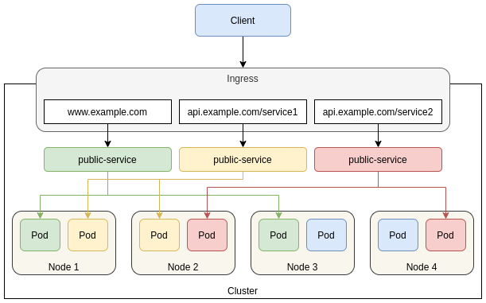

# Ingress

Usually, we use the Service resource to expose an application internally or externally: define an entry point for the application which automatically routes distributed traffic to available pods. The most commonly used types to expose the service outside the cluster are `NodePort` and `LoadBalancer`.

`NodePort` exposes the service over a port from range (30000-32767).  If the nodes have public IPs and access to node port is allowed, the application can be accessed directly by sending the request to NodeIP:NodePort. This means for each service exposed via NodePort, the node port itself needs to be opened on all nodes. This is not a good thing as we would be exposing ports of our worker nodes to the world.

`LoadBalancer` is a wrapper over NodePort which simply creates a load balancer in the cloud provider’s infrastructure that support creation of an external Load Balancer. It adds all nodes as the members of the Load Balancer. This is a far better solution but as the number of public facing services grows, each service needs its own LoadBalancer. 

This is where an Ingress comes into the picture. 

Ingress is an API resource that provides a simple way of describing HTTP and HTTPS routes from outside the cluster to Services within the cluster.

The basic idea behind the Ingress is to provide a way of describing higher level traffic management constraints, specifically for HTTP and define rules for routing traffic without creating a bunch of Load Balancers or exposing each service on the node. It can be configured to give services externally-reachable URLs, load balance traffic, terminate SSL/TLS, and offer name-based virtual hosting and content-based routing.



The Ingress spec contains all the information needed to configure a load balancer or a proxy server. Most importantly, it contains a list of rules matched against all incoming requests. Ingress resources only support rules for directing HTTP traffic.  Besides the base functionality the resource provides, the various ingress controller implementations usually provide several advanced features through custom resource annotations.

```yaml
apiVersion: networking.k8s.io/v1
kind: Ingress
metadata:
  name: ingress-service
spec:
  rules:
  - host: example.com
    http:
      paths:
      - path: /service1
        pathType: Prefix
        backend:
          service: 
            name: service1
            port: 
              number: 80
      - path: /service2
        pathType: Prefix
        backend:
          service: 
            name: service2
            port: 
              number: 80

```

Ingress is one of the built-in APIs which doesn’t have a built-in controller, and an ingress controller is needed to actually implement the `Ingress API`. An ingress controller is usually an application that runs as a pod in a Kubernetes cluster and configures a load balancer according to Ingress Resources. The load balancer can be a software load balancer running in the cluster or a hardware or cloud load balancer running externally.


