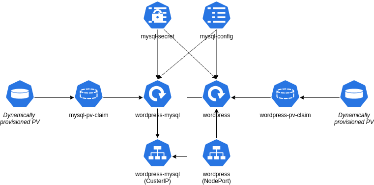

# 	Persistent Stateful Application

In this exercise we will extend the deployment used at the "Stateful Application with local volume" chapter by using PersistentVolumes.



Define required PersistedVolumeClaim to benefit from dynamic provisioning

```yaml
apiVersion: v1
kind: PersistentVolumeClaim
metadata:
  name: mysql-pv-claim
  labels:
    app: wordpress
spec:
  accessModes:
    - ReadWriteOnce
  resources:
    requests:
      storage: 2Gi
---
apiVersion: v1
kind: PersistentVolumeClaim
metadata:
  name: wordpress-pv-claim
  labels:
    app: wordpress
spec:
  accessModes:
    - ReadWriteOnce
  resources:
    requests:
      storage: 2Gi
```

Replace mysql `emptyDir` volume definition to a PVC by specifying `persistentVolumeClaim` object

```yaml
      volumes:
      - name: mysql-storage
        persistentVolumeClaim:
          claimName: mysql-pv-claim
```

Replace wordpress `emptyDir` volume definition to a PVC by specifying `persistentVolumeClaim` object

```yaml
      volumes:
      - name: wordpress-storage
        persistentVolumeClaim:
          claimName: wordpress-pv-claim
```

