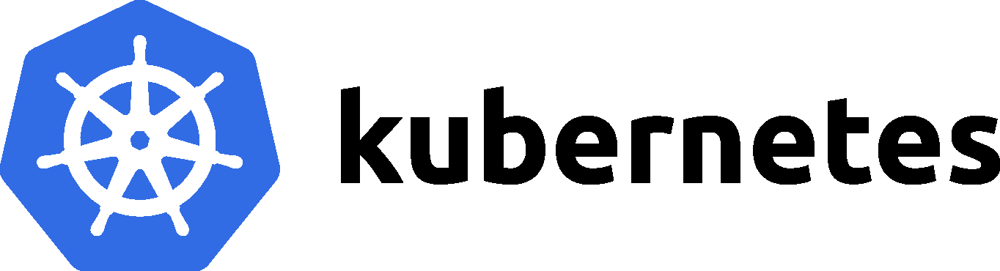

# k8s-workshop

Kubernetes is a portable, extensible, open-source platform for managing containerized workloads and services, that facilitates both declarative configuration and automation.

This workshop is for anyone who wants to understand Kubernetes concepts and use cases in order to design and develop scalable applications.

## Prerequisites

- Laptop
- Kubectl installed (https://kubernetes.io/docs/tasks/tools/install-kubectl/)
- Basic knowledge of containers, container runtimes (Docker, containerd) and containerized applications
- (optional) Comfortable with UNIX command line tools (ssh, curl)
- (optional) Minikube. Access to a Kubernetes cluster will be provided during workshop

## Agenda

#### Kubernetes Overview

[A bit of history](./01-Overview/01-History.md)

[Core components](./01-Overview/02-Core.md)

[Using kubectl](./01-Overview/03-kubectl.md)

#### Workload

[Pods and containers](./02-Workload/)

[Managing configurations and secrets](./02-Workload/)

[ReplicaSets, DaemonSets and Deployments](./02-Workload/)

[Services and Ingress](./02-Workload/)

#### Stateless applications

[Running stateless applications on Kubernetes](./03-Stateless/)

[Scaling](./03-Stateless/)

[Jobs and CronJobs](./03-Stateless/)

[Container patterns (Init, Adapter, Sidecar, Ambassador)](./03-Stateless/)

#### Storage

[Container Storage Interface](./04-Storage/)

[Volumes](./04-Storage/)

[PersistentVolume and PersistentVolumeClaim (PV and PVC)](./04-Storage/)

[StorageClasses](./04-Storage/)

#### Stateful applications

[StatefulSets](./05-Stateful/)

[Running stateful applications on Kubernetes](./05-Stateful/)

#### Networking

[Container Network Interface](./06-Networking/)

[Network policies](./06-Networking/)